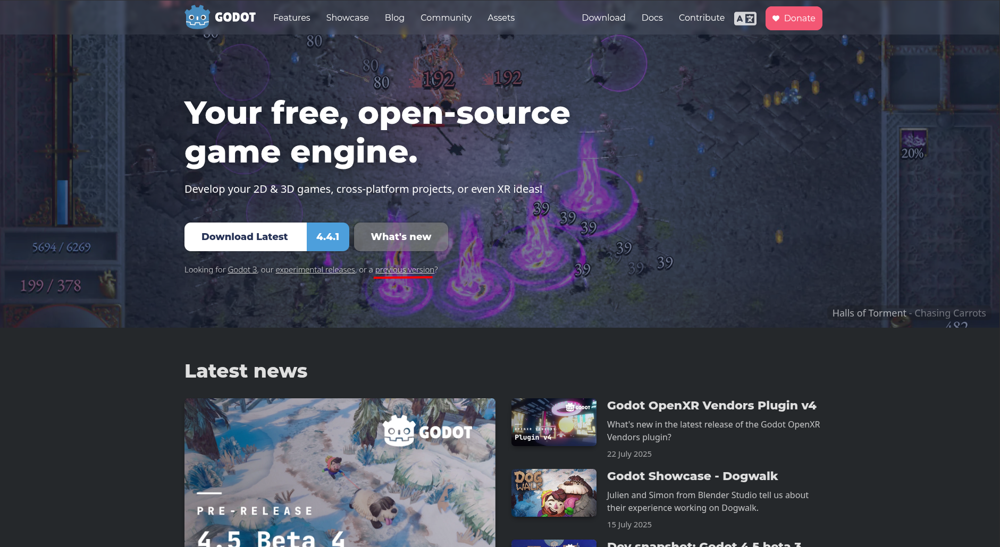
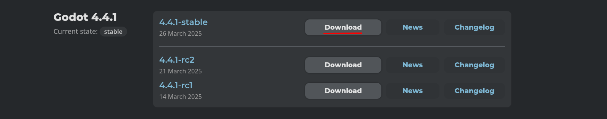
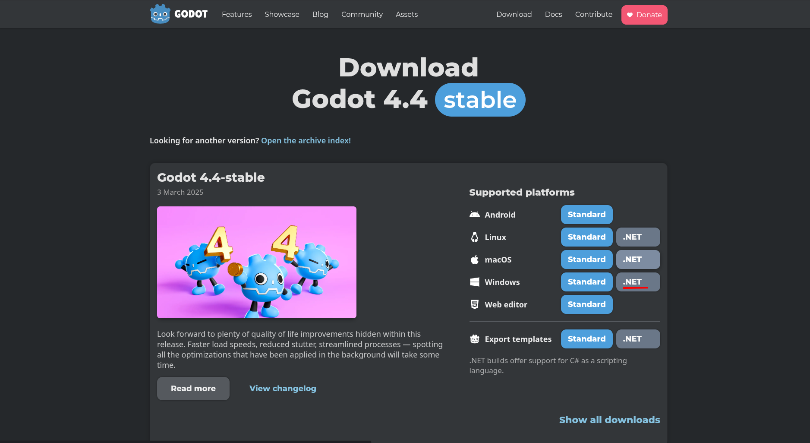

# Getting Started

Prepare o ambiente de desenvolvimento com Godot. Mas antes de começar, veja os reuqisitos.

- [Instalando o Godot (Windows)](#instalando-o-godot-windows)
- [Instalando o Godot (Linux)](#instalando-o-godot-linux)
---

## Requisitos

- **.NET** >=8.0
  - Caso não possua, faça o [download](https://dotnet.microsoft.com/pt-br/download).

---

## Instalando o Godot (Windows)

A versão do Godot que será utilizada no projeto será `Godot v4.4.1` com suporte a `C#`. Acesse a página de download do Godot para baixar o `.zip` da Engine.

Caso versão latest seja a atual, pode clicar no botão `Download Latest`. Caso não seja o caso, pode clicar na oplção `previous version`.

Procure pela versão `4.4.1-stable` e baixe o instalador.

> [!ATTENTION]
> Sempre utilize a versão `Stable`, que como o nome sugere, é o mais estável.

Depois, clique no botão `.NET`, para baixar a versão com suporte a C#.

Ao terminar o download do `.zip`, você deve criar a pasta `C:/Godot`, e em seguida extrair os arquivos do `.zip` para dentro dela. E pronto, o Godot está instalado!

> [!NOTE]
> Você pode notar que tem dois executáveis, `Godot_v4.4-stable_mono_win64.exe` e `Godot_v4.4-stable_mono_win64_console.exe`. Você deve utilizar o `Godot_v4.4-stable_mono_win64.exe` para abrir a Engine.

## Instalando o Godot (Linux)

#TODO