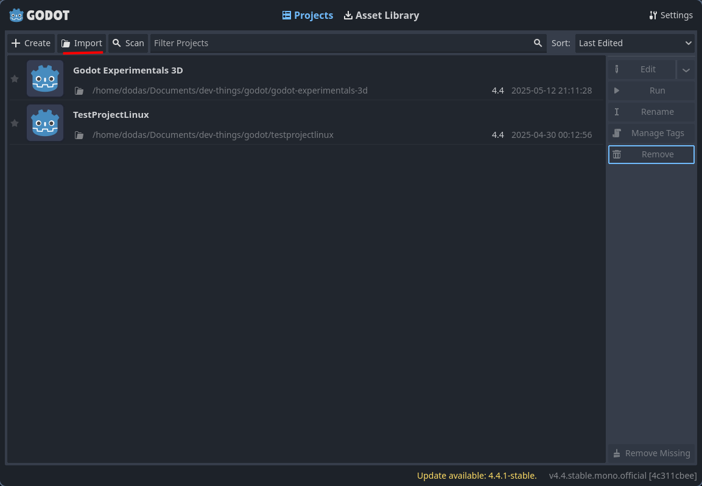
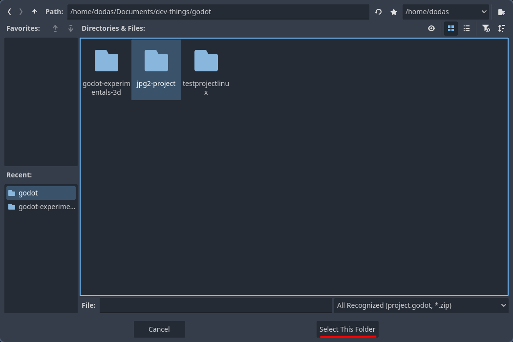
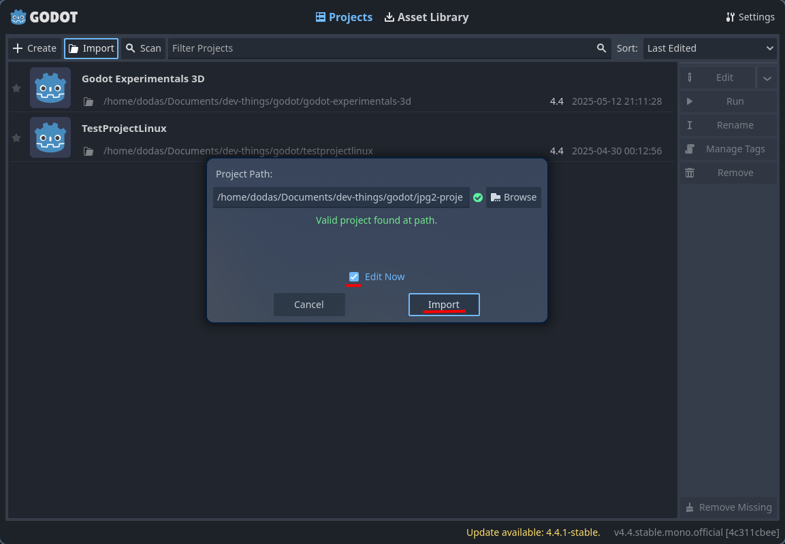

# Getting Started

Prepare o ambiente de desenvolvimento com Godot. Mas antes de começar, veja os reuqisitos.

- [Instalando o Godot](#instalando-o-godot)
- [Abrindo o Projeto](#abrindo-o-projeto)
- [Contributing](#contributing)

---

## Requisitos

- **.NET** >=8.0
  - Caso não possua, faça o [download](https://dotnet.microsoft.com/pt-br/download).

---

## Instalando o Godot

A versão do Godot que será utilizada no projeto será `Godot v4.4.1` com suporte a `C#`. Acesse a página de download do Godot para baixar o `.zip` da Engine.

Caso versão latest seja a atual, pode clicar no botão `Download Latest`. Caso não seja o caso, pode clicar na oplção `previous version`.


Procure pela versão `4.4.1-stable` e baixe o instalador.

> [!ATTENTION]
> Sempre utilize a versão `Stable`, que como o nome sugere, é o mais estável.


Depois, clique no botão `.NET`, para baixar a versão com suporte a C# de acordo com o seu sistema operacional.


### Windows

Ao terminar o download do `.zip`, você deve criar a pasta `C:/Godot`, e em seguida extrair os arquivos do `.zip` para dentro dela. E pronto, o Godot está instalado!

> [!NOTE]
> Você pode notar que tem dois executáveis, `Godot_v4.4-stable_mono_win64.exe` e `Godot_v4.4-stable_mono_win64_console.exe`. Você deve utilizar o `Godot_v4.4-stable_mono_win64.exe` para abrir a Engine.

### Linux

Ao terminar o download do `.zip`, você deve extrair a os arquivos de dentro dele para a pasta `/opt`. Uma boa prática pode ser renomear a pasta extraída para `godot-bin`. Você pode adicionar o binário na pasta de PATH do seu user. Para isso execute:

```bash
sudo ln -s /opt/caminho/para/o/binário /usr/local/bin/godot
```

Agora reinicie seu terminal, e pronto! Você pode abrir o Godot digitando o comando `godot` no terminal.

## Abrindo o Projeto

Agora que você tem o Godot instalado, você está pronto para abrir o projeto. Primeiro, você precisa clonar o projeto. Para isso, execute:

```bash
git clone https://github.com/doda-s/jpg2-project.git
```

Depois de clonar o projeto, será necessário importá-lo para dentro do Godot. Para fazer isso, clique no botão `Importar`.



Irá abrir uma janela de seleção de pasta. Navegue até o diretório onde você fez o clone do projeto. Selecione a pasta, e clique em `Selecionar Esta Pasta`.



Você pode marcar a opção `Editar agora` caso queira que o Godot abra o projeto automaticamente. Depois, basta clicar em `Importar`



## Contributing

Caso queira contribuir, você pode acessar a página [Contributing](#), para ver como fazer isso.